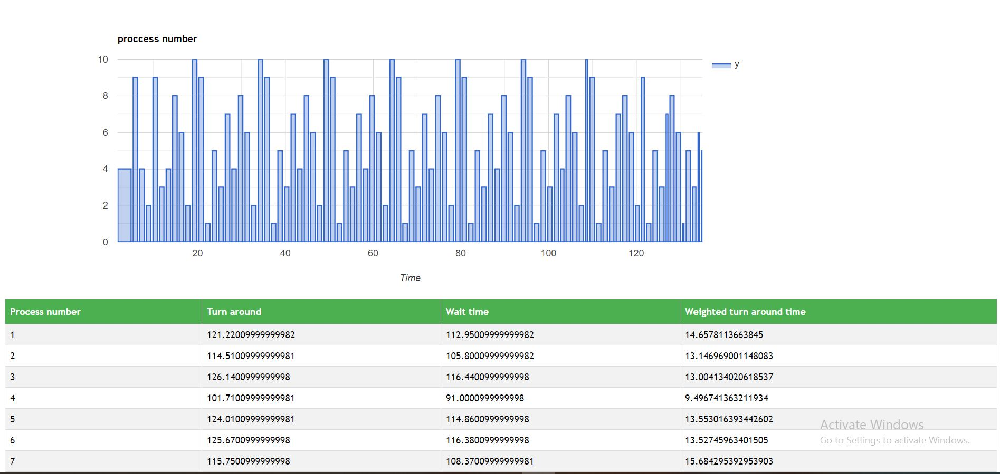

# OS-Scheduler-
Javascript simulation for OS algorithms
  - Round Robin
  - Shortest remaining Job first
  - First come first serve
  - Highest priority first
  
  ## Run the project
  use live server to open index.html
  
  ## Parameters
  assets/test.text 
  - First line for number of processes
  - Second line for mean and std of gaussian distribuation of processes arrival time.
  - Third line for meand and std of gausssian distribution of process excution time.
  - Last line is expected value of possion distribution of process priority
  
  a.js contain test function in which You can specify the algorithm to run.
  
  ## example for output 
  

  ## Proposed algorithm
  Modified Round Robin proposed by our paper is implemented.
  links of paper
  https://drive.google.com/file/d/1ZZlRYwWVlaCfeZwzXQY_-F51wsMZ3kz6/view?usp=sharing
  https://www.youtube.com/watch?v=SpI9kcxBqlg&t=12s
